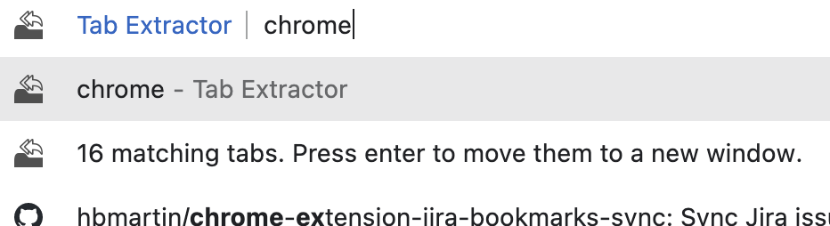

# Tab Extractor 

A browser extension for Chrome and Firefox that reduces tab clutter by moving matching tabs to a new window.

## Features

* **Search from the address bar** — type `ex` followed by a space, then a keyword. Press enter and all tabs whose title or URL contains the keyword move to a new window.
* **Multi-word phrases** — the search text is matched as a whole phrase, so `ex new york` matches tabs containing "new york", not every tab containing "new" or "york".
* **Exclusions** — prefix a word with `-` to exclude it. `ex news -sports` moves tabs matching "news" except those also matching "sports". An exclusion-only search like `ex -github` moves every tab that does *not* match.
* **Extract by domain** — right-click any page and choose **Extract all tabs from this domain** to move every tab from that site to a new window.
* Pinned tabs stay pinned after they move.

## Installation

### Chrome

1. Press the green **Code** button above and choose **Download ZIP**, then unzip it (or grab the packaged zip from the [latest release](https://github.com/hbmartin/chrome-tab-extractor/releases))
2. Go to [chrome://extensions](chrome://extensions) in Google Chrome
3. Turn on **Developer mode** using the toggle in the upper right corner
4. Click the **Load unpacked** button in the upper left corner
5. Select the folder from step 1

### Firefox

1. Download and unzip the extension as above (Firefox 115 or newer)
2. Go to [about:debugging#/runtime/this-firefox](about:debugging#/runtime/this-firefox)
3. Click **Load Temporary Add-on…** and select the `manifest.json` file from step 1

## Development

* The matching logic lives in [`matcher.js`](matcher.js) as pure functions; [`TabExtractor.js`](TabExtractor.js) wires it to the browser APIs.
* Run the unit tests with `npm test` (requires Node.js 20+, no dependencies needed).
* This project is linted and formatted with [Biome](https://biomejs.dev/).
* Tagging a release (`v*`) runs the [release workflow](.github/workflows/release.yml), which packages the extension zip and attaches it to a GitHub release.

## Contributing

* Please [file a bug report](https://github.com/hbmartin/chrome-tab-extractor/issues) for any issues you find.
* Treat other people with kindness, see the [Contributor Covenant](https://www.contributor-covenant.org/).

## License

Licensed under the [Apache License, Version 2.0](LICENSE).

## Authors

* [Harold Martin](https://www.linkedin.com/in/harold-martin-98526971/) - harold.martin at gmail
